# Aula 1 — Atividade: a sua primeira página no ar, e a autópsia dela

**Parte prática da Aula 1.** A teoria está nos slides: internet e web, cliente e servidor, URL, IP, DNS, HTTP (requisição, resposta, código de status, cabeçalhos), cache, HTTPS e a linguagem HTML. Aqui você faz: coloca a sua primeira página no ar e depois examina **a sua própria página** com as ferramentas do navegador, explicando com evidência o que acontece entre digitar o endereço e ver a página.

**Não há resposta pronta aqui.** O servidor é o mesmo para a turma inteira — é o GitHub Pages —, então alguns valores vão coincidir, e tudo bem. O que é seu, e é o que se avalia: a página que você escreveu, os números que dependem dela (quantas requisições, quantos bytes), as capturas com o **seu** endereço na barra, e a explicação de cada dado com as suas palavras. Relatório com dado certo e explicação copiada não pontua.

## A AgroFeira

Durante o semestre inteiro você vai construir um site só: a **AgroFeira**, uma feira de produtores da região de Paragominas — quem vende, o que vende e onde encontrar. Hoje ela é uma página de texto. Ao longo dos encontros ela ganha layout, responsividade e, na segunda metade, comportamento. Tudo no mesmo repositório, do encontro 1 ao 13.

Não existe um "site certo" da AgroFeira para copiar. O conteúdo é seu: escolha os produtos, escreva os textos.

## O que você precisa antes de começar

- Um navegador atualizado (Chrome, Firefox, Edge ou Safari) e internet.
- A sua **conta educacional do GitHub**, já verificada como estudante. Se a verificação ainda não saiu, dá para fazer tudo assim mesmo: a conta gratuita comum também tem Codespaces, com uma cota menor (veja o Passo 12).
- A **apostila de GitHub**, entregue em aula e publicada no SIGAA. Ela tem o passo a passo de conta, repositório e publicação; este roteiro aponta para ela em vez de repetir.
- **Os slides da Aula 1**, principalmente o quadro final "As tags de hoje — e só elas".
- Os **exemplos da aula**, que você abre no Passo 3.

**Você não instala nada no computador.** Todo o trabalho acontece no **GitHub Codespaces**: um computador na nuvem com o Visual Studio Code aberto dentro do navegador. Não é preciso saber Git — o Codespaces salva e envia por você, por botão.

---

# Parte A — Montar o ambiente

## Passo 1 — O seu repositório

Com a sua conta do GitHub aberta, clique no **+** no alto à direita de qualquer página do GitHub e escolha **New repository** (ou vá direto a `github.com/new`).

Crie um repositório **público** chamado `agrofeira-<seu-usuário>` — troque pelo seu nome de usuário do GitHub. Ele é o repositório do semestre inteiro.

Três coisas para conferir nessa tela, e a terceira é a que mais dá problema:

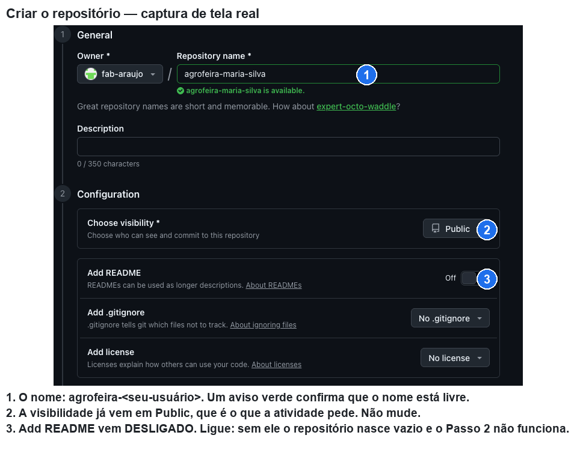

**Ligue o Add README.** Ele vem desligado, e um repositório completamente vazio não oferece o botão que você vai usar no Passo 2.

**Guarde o endereço:** `https://github.com/<seu-usuário>/agrofeira-<seu-usuário>`. Ele entra no relatório.

## Passo 2 — Abrir o Codespaces neste repositório

> **Leia antes:** um codespace pertence a **um** repositório. O que você criar dentro dele vai para aquele repositório e para nenhum outro. Neste roteiro você abre **um único codespace, no `agrofeira-<seu-usuário>`**. É lá que o seu site é escrito.

1. Abra a página do repositório que você criou no Passo 1. Confira, no alto: tem que estar `<seu-usuário> / agrofeira-<seu-usuário>`.
2. Clique no botão verde **Code**.
3. Troque para a aba **Codespaces** e clique em **Create codespace on main**.
4. Espere. Na primeira vez leva um ou dois minutos: o GitHub está ligando um computador para você.

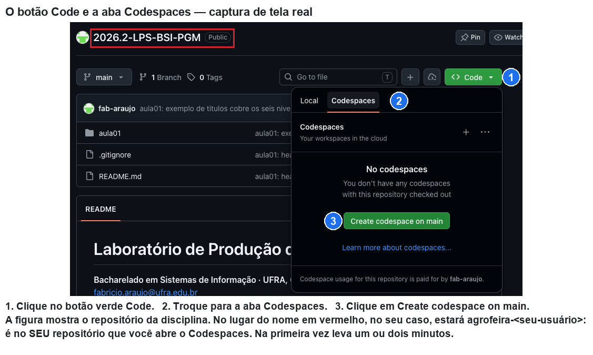

Quando terminar, o Visual Studio Code abre dentro do navegador. A janela é assim:

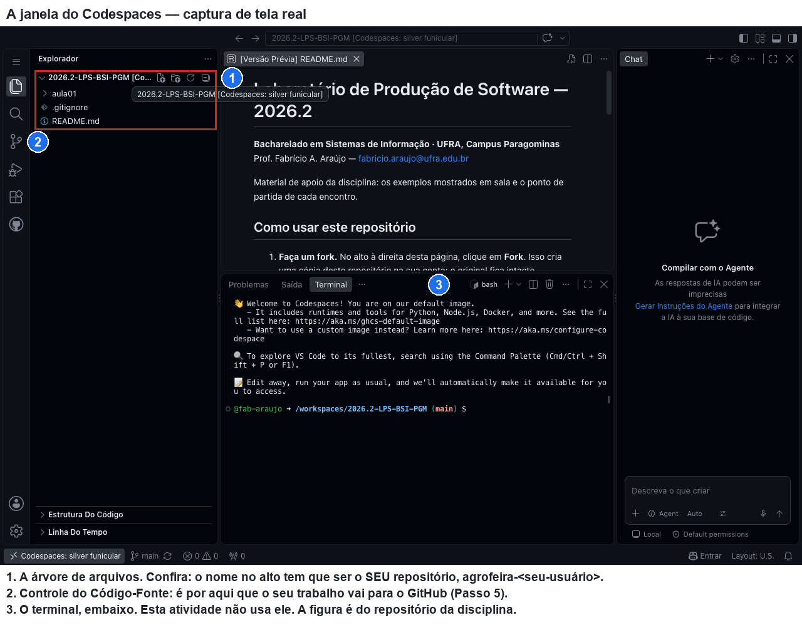

Confira o nome do repositório no alto da árvore de arquivos, à esquerda: tem que ser o **seu**. Se estiver outro, feche e volte ao item 1.

Três lugares estão numerados na figura: **1**, a árvore de arquivos, à esquerda, onde o seu `index.html` vai aparecer; **2**, o **Controle do Código-Fonte**, por onde o trabalho vai para o GitHub, no Passo 5; e **3**, o terminal, embaixo — esta atividade não usa ele.

> **A interface pode vir em português.** O Codespaces segue o idioma do seu navegador, então os nomes dos painéis e dos botões podem aparecer traduzidos: *Explorador* em vez de *Explorer*, *Controle do Código-Fonte* em vez de *Source Control*, *Confirmação* em vez de *Commit*. Ao longo deste roteiro os dois nomes aparecem, nesta ordem: português e inglês.

**O codespace se desliga sozinho** depois de 30 minutos sem uso, e você não perde nada: ao reabrir, ele volta no ponto em que estava. Mesmo assim, pare o seu ao terminar — é o Passo 12.

## Passo 3 — Os exemplos da aula

O repositório da disciplina tem os exemplos mostrados em sala, um arquivo por exemplo:

**https://github.com/fab-araujo/2026.2-LPS-BSI-PGM**

1. Abra o endereço acima, já com a sua conta do GitHub aberta.
2. Entre na pasta `aula01/exemplos/` e clique em qualquer arquivo: o GitHub mostra o código na própria página, sem você precisar de nada.

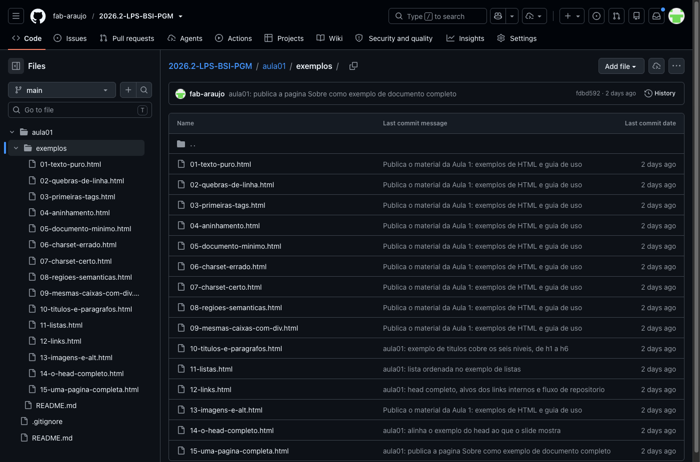

> **Este repositório é material de consulta, não é onde você trabalha.** Não crie nada nele e não abra Codespaces nele. É também aqui que você tira dúvida sobre um exemplo. O seu site é escrito no codespace do Passo 2, no `agrofeira-<seu-usuário>`.

---

# Parte B — Colocar a página no ar

## Passo 4 — O documento HTML

**No codespace do Passo 2** — aquele cuja árvore de arquivos mostra `agrofeira-<seu-usuário>` —, crie na raiz o arquivo **`index.html`** e escreva nele o documento da AgroFeira.

Para criar o arquivo: passe o mouse sobre o nome do repositório, no alto da árvore à esquerda. Aparecem quatro ícones pequenos; o primeiro é **Novo Arquivo**. Clique nele, digite `index.html` e tecle Enter. O arquivo abre no editor, vazio.

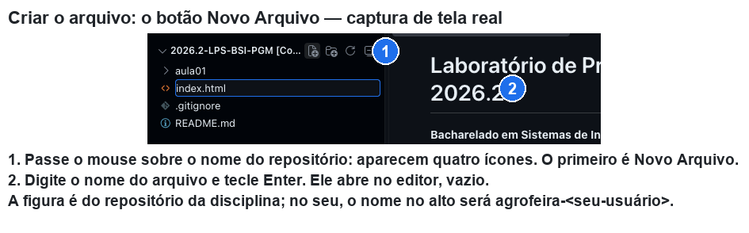

> **Como ver a página enquanto escreve.** Nesta primeira atividade, o jeito de ver é **publicar**: escrever, salvar (Passo 5) e recarregar o endereço público (Passo 6). Leva um ou dois minutos a cada vez, então escreva um trecho maior antes de conferir. Existem jeitos de ver o resultado na hora, sem publicar, e eles entram no encontro 8 — antes disso ficariam entre você e o assunto das aulas.

**Salvar o arquivo:** `Ctrl+S` (no Mac, `Cmd+S`). Uma bolinha no nome da aba quer dizer que há coisa não salva.

O documento precisa conter, e nada além disso:

| Onde | O que precisa haver |
|---|---|
| Primeira linha | a declaração de tipo do HTML |
| Elemento raiz | com o atributo de idioma declarando português do Brasil |
| Cabeçalho do documento | a codificação de caracteres, a linha de viewport e o título da página |
| Corpo — topo | a região de cabeçalho, com o título principal da página e uma região de navegação contendo uma lista de dois links internos |
| Corpo — meio | a região de conteúdo principal, dividida em **duas partes**. Cada parte **começa por um título de segundo nível**, e é esse título que leva o identificador próprio — é nele que os dois links do menu vão dar. Não é preciso nenhuma caixa em volta. A primeira parte traz um parágrafo de apresentação; a segunda, uma lista com **três produtos** da feira, cada um com a unidade em que é vendido |
| Corpo — fim | a região de rodapé, com um parágrafo curto |

Regras que valem para a correção: **um** título de primeiro nível na página; a região de conteúdo principal é única; sem nenhum estilo e sem nenhum script.

As tags de que você precisa estão todas no quadro final dos slides, "As tags de hoje — e só elas", e todas aparecem nos exemplos do Passo 3.

**Sobre consultar:** olhar os slides e os exemplos à vontade faz parte — é para isso que eles existem, e reabrir um exemplo para lembrar como uma tag se escreve não é problema nenhum. O que não vale é entregar arquivo de outra pessoa, de um gerador de páginas ou de um assistente: o documento tem que ser escrito por você, com o conteúdo escolhido por você.

Nomes de arquivo em minúsculas, sem espaço e sem acento.

**Captura 1:** a tela do Codespaces com o seu `index.html` aberto no editor, mostrando a árvore de arquivos à esquerda com o nome do repositório.

## Passo 5 — Salvar no GitHub

O codespace é uma máquina separada: o que você escreve nele só chega ao repositório quando você manda.

1. Abra o painel **Controle do Código-Fonte** (*Source Control*) — o ícone de ramificação, na barra lateral. Um número ao lado dele indica quantos arquivos mudaram.
2. Escreva uma mensagem curta dizendo o que mudou.
3. Clique no botão verde: **Confirmação** (*Commit*). Se aparecer uma caixa perguntando se você quer preparar todas as alterações e confirmá-las direto — em português, *"Não há nenhuma alteração preparada a ser confirmada. Deseja preparar automaticamente todas as alterações e confirmá-las diretamente?"*; em inglês, *"There are no staged changes to commit. Would you like to stage all your changes and commit them directly?"* —, responda **Sim** (*Yes*).
4. Clique em **Sincronizar alterações** (*Sync changes*). Na primeira vez o botão pode se chamar **Publicar Branch** (*Publish branch*).
5. Aparece uma segunda caixa, avisando que a ação vai *"efetuar pull e push das confirmações de e para origin/main"* — é o jargão de "mandar o que você fez e trazer o que mudou". Responda **OK** (ou **OK, Não Mostrar Novamente**, para ela não voltar).
6. Recarregue a página do repositório no GitHub: o `index.html` tem que aparecer lá.

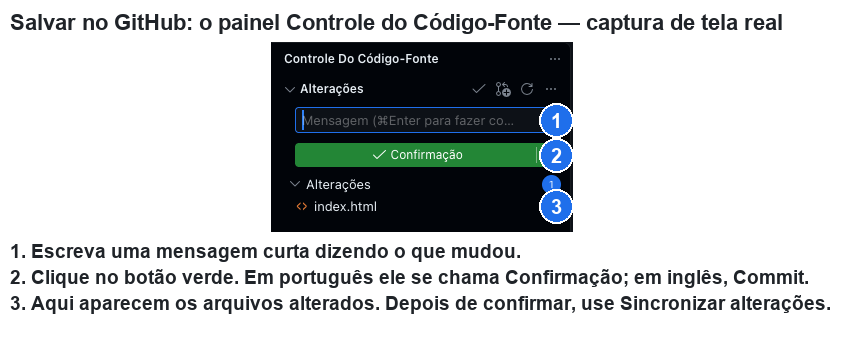

Repita este passo sempre que mudar alguma coisa. **O que não foi sincronizado não está publicado**: continua só dentro do codespace.

## Passo 6 — A página no ar

O GitHub Pages não liga sozinho: você **ativa uma vez**, neste repositório.

1. No seu repositório, abra **Settings** (aba do alto) e, no menu à esquerda, **Pages**.
2. Em **Build and deployment → Source**, confira que está **Deploy from a branch**. Em **Branch**, escolha **main** e a pasta **/ (root)**, e clique em **Save**.

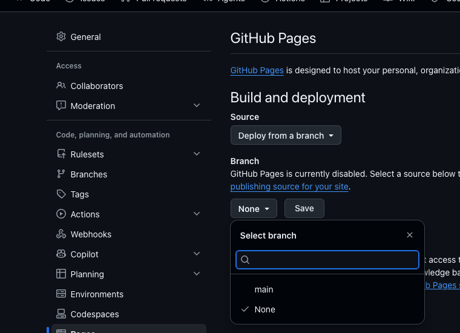

O endereço fica no formato:

```
https://<seu-usuário>.github.io/agrofeira-<seu-usuário>/
```

A primeira publicação **leva alguns minutos**. Se der erro 404, espere um ou dois minutos e recarregue. Se continuar, volte a **Settings > Pages**: quando a publicação termina, o endereço aparece numa faixa no alto dessa página. Quando você corrigir o arquivo mais tarde, o endereço público também demora um pouco para refletir a mudança.

Abra esse endereço num aparelho **fora da rede do laboratório** — o seu celular, usando dados móveis, serve. É a prova de que a página está mesmo pública, e não só visível de onde você está.

É também aqui que você confere o que escreveu: este endereço é a sua pré-visualização nesta atividade.

**Confira os dois links do menu.** Clique em cada um deles: a página tem que rolar até a seção correspondente, e o endereço na barra tem que ganhar o `#` com o nome no fim. Se não acontecer nada, o link e o destino não estão casados — e esse é um erro que nem o validador do Passo 7 acusa.

**Captura 2:** a página aberta no celular, com o endereço visível na barra.

## Passo 7 — O documento tem que ser válido

1. Abra `https://validator.w3.org/`, escolha a opção de validar por endereço e cole o **endereço público** do Passo 6.
2. Corrija no `index.html` todo **erro** apontado, salve e sincronize (Passo 5), espere a publicação e valide outra vez, até não restar erro. Avisos (*warnings*) não precisam ser corrigidos, mas leia o que dizem.

**Captura 3:** a tela do validador com o resultado final da sua página.

A figura abaixo é a tela do validador rodando sobre um site que **não é o seu**. Serve para você reconhecer onde cola o endereço, como um erro aparece e o que a faixa azul do fim quer dizer.

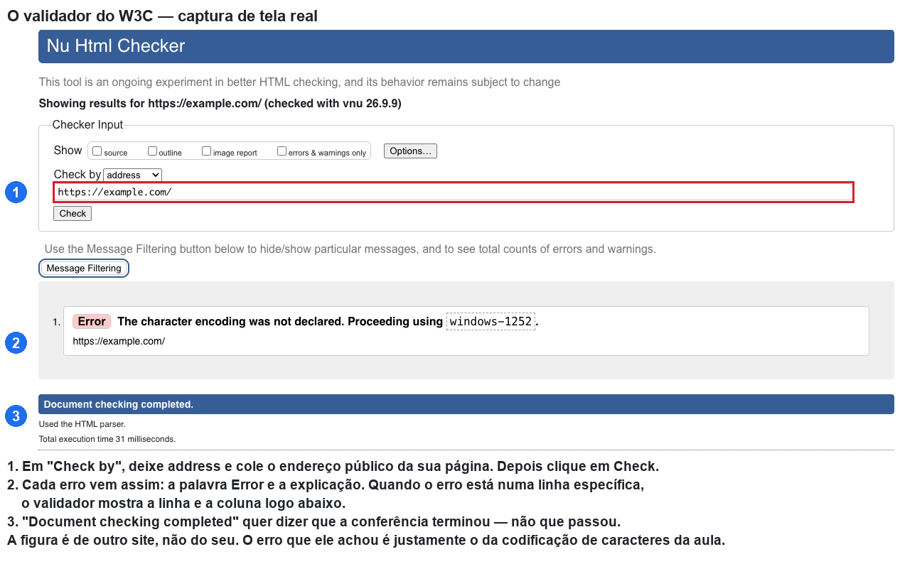

---

# Parte C — A autópsia

> **Tudo nesta parte é feito no endereço público do Passo 6.** É o único endereço da sua página nesta atividade, e é o que a correção espera.

## Passo 8 — A primeira requisição: método, status e cabeçalhos

1. Abra o **endereço público** da sua página. Pressione **F12** (ou botão direito e *Inspecionar*) e vá à aba **Rede** (*Network*).

> **No Safari, F12 não funciona** e *Inspecionar* não aparece no menu do botão direito até você ativar isso uma vez: **Safari > Ajustes > Avançado** e marque **Mostrar recursos para desenvolvedores web**. Feito isso, o menu **Desenvolver** aparece e o botão direito passa a oferecer *Inspecionar Elemento*.

2. Marque **Desativar cache** (*Disable cache*) na própria aba, para que o primeiro carregamento seja de verdade.
3. Recarregue a página. Aparece uma lista com uma linha por arquivo pedido, com colunas de nome, status, tipo, tamanho e tempo. O que você quer é a **linha do seu documento HTML** — normalmente a primeira, e ela costuma aparecer com o nome da pasta ou uma barra em vez de `index.html`, porque foi isso que você digitou no endereço. Confira pela coluna de tipo: é a linha cujo tipo é `document`. Se aparecer antes dela uma linha com status na casa dos 300, ela é um redirecionamento: anote que existiu e siga para a linha do documento.
4. Clique nessa linha e abra a sub-aba **Cabeçalhos** (*Headers*). Ela traz dois blocos: os **cabeçalhos de requisição** (*Request Headers*), que o seu navegador mandou, e os **cabeçalhos de resposta** (*Response Headers*), que o servidor devolveu. O que interessa aqui são os **de resposta**.
5. **Anote todos os cabeçalhos de resposta** agora, com nome e valor. Você vai precisar deles de novo no Passo 10.

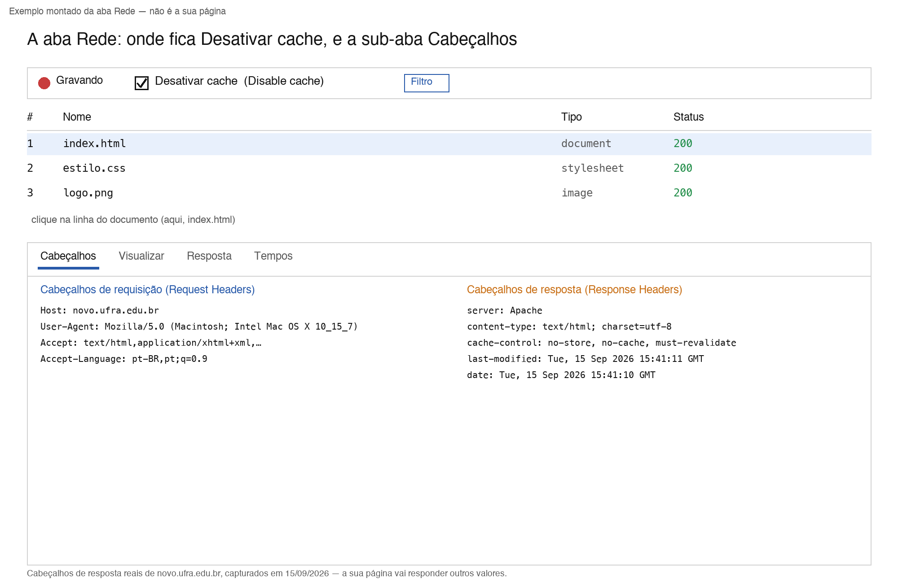

**Captura 4:** a primeira requisição selecionada, mostrando o método, o código de status e os cabeçalhos da resposta.

**Relatório, item 1:** o **método** e o **código de status** da primeira requisição, e o que esse código significa para esta requisição. Depois escolha **três cabeçalhos de resposta** entre os que apareceram e, para cada um, diga em uma ou duas frases o que ele informa ao navegador sobre a *sua* página. Cite nome e valor exatamente como apareceram.

## Passo 9 — A página inteira

Ainda na aba Rede, com o cache desativado, olhe o rodapé da lista: o navegador resume quantas requisições a página fez e quanto foi transferido.

**Captura 5:** a lista completa, com o rodapé visível.

> **Um pedido vai aparecer sem você ter escrito nada que o peça:** `favicon.ico`, com status 404. É o ícone que o navegador mostra na aba; todo navegador o procura sozinho, e como você não pôs nenhum, o servidor responde que não existe.

**Relatório, item 2:** quantas requisições a sua página dispara e qual o total transferido. Liste o que foi pedido além do documento HTML e explique, para cada um, por que ele aconteceu — inclusive o `favicon.ico`, com as suas palavras. Compare com a figura abaixo, que é a home de um site grande, e comente a diferença em uma frase.

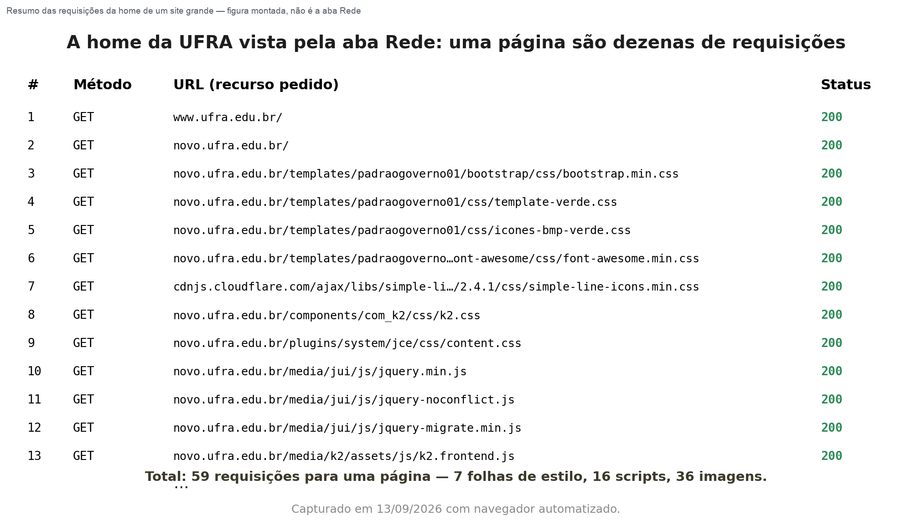

## Passo 10 — O segundo carregamento

Desmarque *Desativar cache* e recarregue a página duas vezes seguidas. Observe a coluna de tamanho e o código de status de cada linha.

**Captura 6:** esse segundo carregamento.

**Relatório, item 3:** o que mudou em relação ao Passo 9 — tamanho, código de status, tempo — e **por quê**. Aponte, entre os cabeçalhos de resposta que você anotou no Passo 8, qual linha explica o comportamento observado. Se nada mudou, diga isso e proponha uma explicação.

## Passo 11 — Por que o endereço é HTTPS

No **Chrome** e no **Edge**: clique no ícone à esquerda do endereço, depois em **A conexão é segura** e então em **O certificado é válido**.

No **Firefox** o caminho é outro: clique no cadeado, depois em **Conexão segura**, em **Mais informações** e, na janela que abre, em **Ver certificado** — abre numa aba nova. No **Safari**: clique no cadeado e em **Mostrar certificado**.

**Captura 7:** a tela do certificado.

**Relatório, item 4:** o que o `https://` garante para quem acessa a sua página, o que **não** garante, e quem emitiu o certificado. Você não configurou nada disso — diga, em uma frase, quem configurou.

## Passo 12 — Parar o Codespaces

A sua conta educacional dá **180 horas de cota** por mês de Codespaces (na conta gratuita comum são 120). Atenção à conta: a máquina padrão tem dois núcleos e consome **duas horas de cota por hora ligada** — ou seja, 180 de cota são cerca de **90 horas** de ambiente ligado por mês. E a cota corre enquanto o ambiente está **ligado**, mesmo que você não esteja digitando.

1. Volte ao GitHub e abra [github.com/codespaces](https://github.com/codespaces).
2. No seu codespace, clique nos três pontos e escolha **Stop codespace**.
3. Nada se perde: da próxima vez ele volta no ponto em que estava.

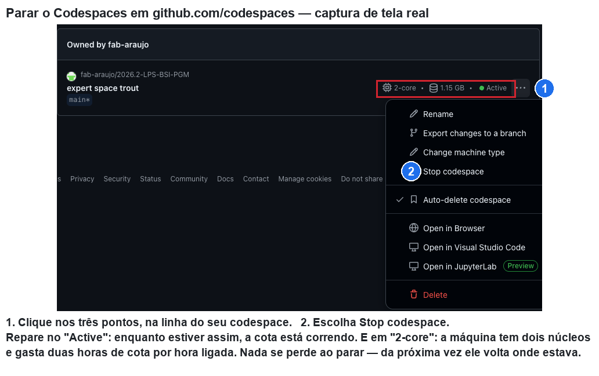

Se estiver num computador do laboratório, **saia da sua conta do GitHub** antes de levantar.

> **Atalho para edições pequenas.** Em qualquer repositório, apertar a tecla **`.`** abre o editor `github.dev`, também no navegador e **sem consumir a sua cota**. Ele escreve, salva e sincroniza igual ao Codespaces; o que ele não tem é terminal. Para esta atividade, ele serve para tudo.

---

# O relatório

## Como escrever

O relatório é de **texto**, em torno de uma página; as capturas não entram nessa conta. Use os quatro itens como títulos. Em cada um: o dado observado e a explicação, com as suas palavras, apontando a captura correspondente. A correção pergunta sobre o **seu** site. Como o servidor é o mesmo para todo mundo, vários dados vão coincidir com os do colega — o que não pode coincidir é a explicação, que tem que ser escrita por você, sobre o que você viu na sua tela.

Formato de uma resposta boa, num caso inventado de um site fictício (`exemplo.org`, que não existe — **não copie nada daí: nem o código de status, nem os cabeçalhos. A sua página responde outra coisa, e é a sua que vale**):

> **Item 1.** Método `GET`, status `301`: o servidor não entregou a página — avisou que ela mudou de endereço para sempre e disse para onde ir, e o navegador seguiu sozinho. Cabeçalhos: `location: https://exemplo.org/novo/` — é o endereço novo, e é ele que o navegador pediu em seguida; `x-powered-by: Exemplo/2.1` — o servidor conta qual programa gerou a resposta, o que não é necessário e alguns sites escondem; `x-frame-options: DENY` — proíbe que outra página embuta esta num quadro, uma proteção contra golpe de clique disfarçado.

O que torna a resposta boa: nome e valor exatos, uma frase sobre o que a linha informa e a ligação com o que o navegador fez. Sem isso, é cópia de definição.

Escreva o relatório onde você preferir, mas **guarde o arquivo num lugar seu** (e-mail, nuvem, pen drive) entre uma sessão e outra: o computador do laboratório não é seu e pode ser limpo.

## O que vai no PDF, nesta ordem

1. Seu nome completo e matrícula.
2. O endereço do repositório (`https://github.com/<seu-usuário>/agrofeira-<seu-usuário>`).
3. O endereço público do site (`https://<seu-usuário>.github.io/agrofeira-<seu-usuário>/`).
4. **Item 1** — método, status e três cabeçalhos de resposta + **Captura 4**.
5. **Item 2** — total de requisições e de bytes + **Captura 5**.
6. **Item 3** — o que mudou no segundo carregamento e por quê + **Captura 6**.
7. **Item 4** — o que o HTTPS garante e quem emitiu o certificado + **Captura 7**.
8. **Anexo** — **Captura 1** (editor), **Captura 2** (celular) e **Captura 3** (validador).

São **sete capturas** no total, numeradas de 1 a 7 como acima.

## Autoverificação

- [ ] O repositório é público e se chama `agrofeira-<meu-usuário>`.
- [ ] Abri o Codespaces **no meu repositório**, e a árvore de arquivos mostra `agrofeira-<meu-usuário>`.
- [ ] O `index.html` está na raiz desse repositório, não no repositório da disciplina.
- [ ] Confirmei e sincronizei (Passo 5): o arquivo aparece no GitHub, não só no Codespaces.
- [ ] O `index.html` tem tudo o que a tabela do Passo 4 pede, e nada de estilo ou script.
- [ ] Cliquei nos **dois** links do menu e cada um levou à sua seção.
- [ ] O endereço público abre a página num aparelho fora da rede do laboratório.
- [ ] O validador não aponta nenhum **erro** no endereço público.
- [ ] O arquivo no GitHub é o mesmo que está no ar (publiquei depois da última correção).
- [ ] Toda a Parte C foi feita no **endereço público**.
- [ ] Tenho as **sete** capturas, numeradas, e todas são da **minha** página.
- [ ] Cada um dos quatro itens tem dado observado **e** explicação.
- [ ] Os dois endereços estão no começo do PDF.
- [ ] Parei o codespace.

## Pontuação

**1,0 ponto na Nota 1.** A correção olha para duas partes — o site no ar e o relatório —, mas o envio é um só (o PDF, com os dois endereços dentro) e a nota também é uma só, pela **rubrica de produção**, que é a dominante aqui. O relatório não tem nota separada: ele é o que comprova o segundo critério. Os três critérios e seus pesos:

- **60% funciona e atende ao roteiro** — o site está no ar no endereço público, o documento tem o que o Passo 4 pede, e o relatório traz as evidências e as quatro respostas.
- **25% aplicação correta dos conceitos da aula** — a leitura do status, dos cabeçalhos, do segundo carregamento e do HTTPS está certa para o *seu* caso, e a explicação liga o dado ao que o navegador fez.
- **15% qualidade básica** — marcação válida (Passo 7), capturas legíveis e da própria página, texto claro, nomes de arquivo em minúsculas e sem acento. Os itens de acessibilidade deste critério entram a partir da Atividade 2.

Um item sem a captura correspondente, ou com captura ilegível, perde o critério de qualidade daquele item e não pontua a parte do roteiro que a captura comprovaria. Uma resposta que copie a definição do slide sem ligá-la ao dado observado na sua página não pontua o critério de aplicação.

## Entrega

- **Formato:** um único arquivo PDF, `atividade01_<seu-usuário>.pdf`, com o conteúdo na ordem da seção "O que vai no PDF".
- **Canal:** SIGAA.
